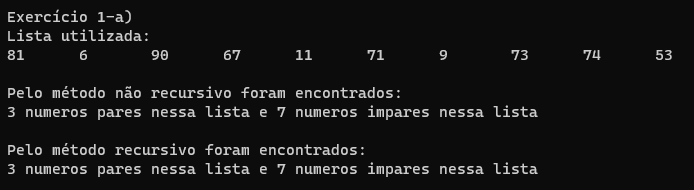

# Treinamento em Listas, Pilhas e Filas Estáticas e Dinâmicas

## Conteúdos

 <a href="#apresentação">Apresentação</a> •
 <a href="#lógica">Lógica</a> • 
 <a href="#exemplo">Exemplo</a> • 
 <a href="#compilação-e-execução">Compilação e Execução</a> • 
 <a href="#autores">Autores</a> • 

---

## Apresentação

Este é um subexercício de uma Lista de Exercícios, quem criou esta lógica, a implementou e como compila-la pode ser visto na [explicação do Exercício geral](/Exercicio%201/). Aqui só trataremos do subexercício A. 

O enunciado deste subexercício é o seguinte:

    A) Escreva uma função recursiva e outra não recursiva para contar o número de elementos pares e impares contidos em uma lista dinâmica.

Com isso, foi trabalhada a lógica abaixo, que provou ter tido êxito apresentando uma solução plausível para este problema!

## Lógica

Para a forma não recursiva foi feita uma função simples, que retorna se um número é par ou não, para isso bastou pegar o resto de uma divisão do número por 2, se houvesse resto, era ímpar, se não, era par. Com isso, a maneira não recursiva precisa de um ponteiro que irá caminhar nesta Lista, e sempre checar se é par ou não, somando 1 em seu respectivo inteiro.

Para a forma recursiva, a função é bem parecida, apesar de menos intuitiva. É enviado o primeiro Bloco da Lista para a função, e ela tem duas opções, parar se for o último Bloco da Lista, ou chamar a própria função, mas mandando o próximo Bloco. Ao bater no último Bloco, este verifica se é par ou não e começa a retornar somando sempre mais uma unidade a opção que for a correta.

---

## Exemplo

### Saída

---

## Compilação e Execução

O programa feito de acordo com a proposta possui um arquivo Makefile que realiza todo o procedimento de compilação e execução. Para tanto, temos as seguintes diretrizes de execução:

| Comando                |  Função                                                                                           |                     
| -----------------------| ------------------------------------------------------------------------------------------------- |
|  `make clean`          | Apaga a última compilação realizada contida na pasta build                                        |
|  `make`                | Executa a compilação do programa utilizando o gcc, e o resultado vai para a pasta build           |
|  `make run`            | Executa o programa da pasta build após a realização da compilação             

---

## Autores

Elaborado por [Henrique Souza Fagundes](https://github.com/ohenriquesouza), [Joao Pedro Martin Espíndola](https://github.com/JoaoMEspindola?tab=repositories), [Pedro Henrique Louback Campos](https://github.com/PedroLouback) e [Pedro Pinheiro](https://github.com/ppinheirosiqueira) 

Alunos do 3° periodo do curso de `Engenharia da Computação` no [CEFET-MG](https://www.cefetmg.br)
