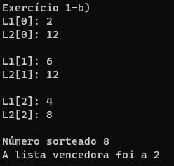

# Treinamento em Listas, Pilhas e Filas Estáticas e Dinâmicas

## Conteúdos

 <a href="#apresentação">Apresentação</a> •
 <a href="#lógica">Lógica</a> • 
 <a href="#exemplo">Exemplo</a> • 
 <a href="#compilação-e-execução">Compilação e Execução</a> • 
 <a href="#autores">Autores</a> • 

---

## Apresentação

Este é um subexercício de uma Lista de Exercícios, quem criou esta lógica, a implementou e como compila-la pode ser visto na [explicação do Exercício geral](/Exercicio%201/). Aqui só trataremos do subexercício B. 

O enunciado deste subexercício é o seguinte:

    B) Crie uma função que simule um pequeno jogo que utiliza duas listas (i.e., L1 e L2). Nesse, cada lista possui tamanho máximo de 3 entradas e cada posição deve armazenar um número inteiro aleatório entre 1 e 13. Nesse jogo, após preencher ambas as listas, selecione também de forma aleatória mais um valor entre 1 e 13 e mostre-o na tela. A regra do jogo é a seguinte: Ambas as listas devem ser apresentadas por leitura sequencial a partir de suas posições de paridade, ou seja, {{L1[0],L2[0]}, {L1[1],L2[1]}, {L1[2],L2[2]}}. Cada par deve ser subtraído do valor apresentado e ganha o jogo a lista que apresentar a maior soma final. Mostre o ganhador ao final.

Com isso, foi trabalhada a lógica abaixo, que provou ter tido êxito apresentando uma solução plausível para este problema!

## Lógica

Como todos os números são aleatórios entre valores pré-estabelecidos, a lógica para a resolução deste problema é direta. No começo são criadas duas variáveis inteiras com valor de 0, cada uma ficará responsável por ser a soma total de cada lista. Em seguida é sorteado o número aleatório que será subtraido destas Listas.

Com esse valor sorteado, são criadas as Listas ao mesmo tempo valor por valor, ou seja, é criado primeiro L1[0] e L2[0], para depois ser criado L1[1] e L2[1]. Ao serem criados os dois valores, já são apresentados ao usuário, e internamente são subtraídos do valor sorteado antes da criação da Lista e esta subtração é somada a variável de soma total de cada Lista. Assim, ao chegar no último valor da Lista já foram cumpridas todas as etapas pedidas (demonstração dos pares) e só resta a comparação entre qual soma é a maior.

---

## Exemplo

### Saída

---

## Compilação e Execução

O programa feito de acordo com a proposta possui um arquivo Makefile que realiza todo o procedimento de compilação e execução. Para tanto, temos as seguintes diretrizes de execução:

| Comando                |  Função                                                                                           |                     
| -----------------------| ------------------------------------------------------------------------------------------------- |
|  `make clean`          | Apaga a última compilação realizada contida na pasta build                                        |
|  `make`                | Executa a compilação do programa utilizando o gcc, e o resultado vai para a pasta build           |
|  `make run`            | Executa o programa da pasta build após a realização da compilação             

---

## Autores

Elaborado por [Henrique Souza Fagundes](https://github.com/ohenriquesouza), [Joao Pedro Martin Espíndola](https://github.com/JoaoMEspindola?tab=repositories), [Pedro Henrique Louback Campos](https://github.com/PedroLouback) e [Pedro Pinheiro](https://github.com/ppinheirosiqueira) 

Alunos do 3° periodo do curso de `Engenharia da Computação` no [CEFET-MG](https://www.cefetmg.br)
