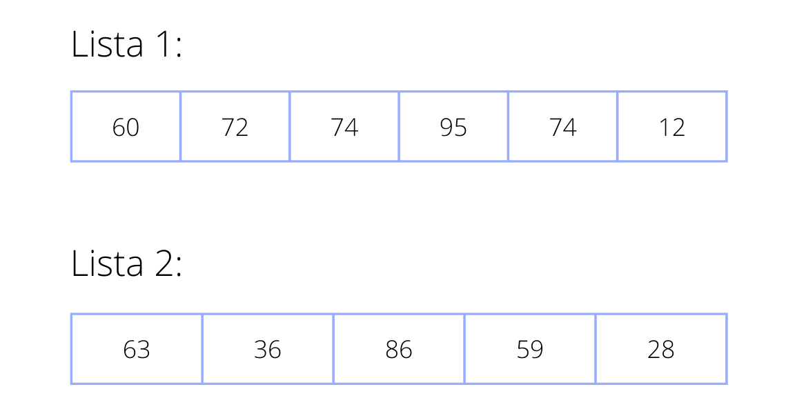
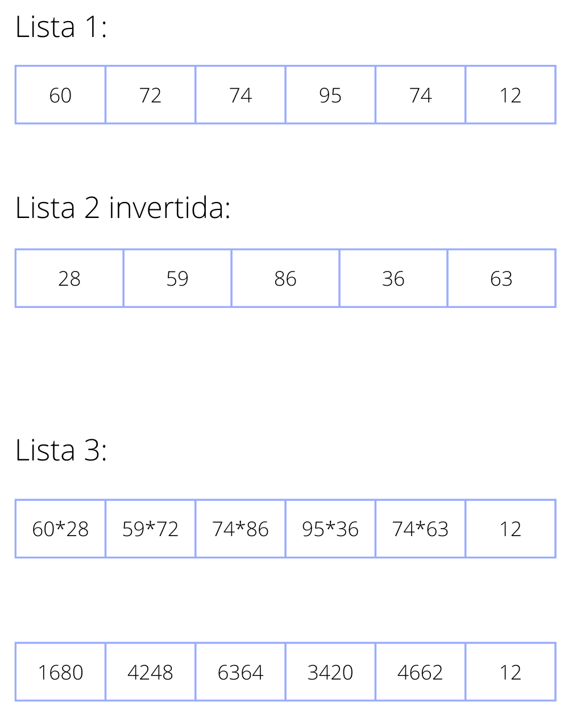
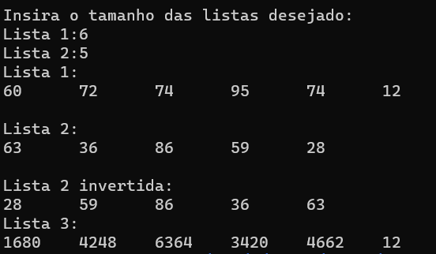

# Treinamento em Listas, Pilhas e Filas Estáticas e Dinâmicas

## Conteúdos

    <a href="#apresentação">Apresentação</a> •
    <a href="#lógica">Lógica</a> • 
    <a href="#exemplo">Exemplo de execução</a> •
    <a href="#compilação-e-execução">Compilação e Execução</a> • 
    <a href="#autores">Autores</a>

---

## Apresentação

Foi proposto pelo professor [Michel Pires da Silva](http://lattes.cnpq.br/1449902596670082) da matéria de `Arquitetura e Estruturas de Dados 1 do 3º Período do curso de Engenharia da Computação` uma lista de exercícios para treinamento de 3 tipos diferentes de `Estruturas de Dados` com o objetivo de praticar e adquirir experiência com esses diferentes tipos. O exercício de nº 1, contém práticas do Tipo Abstrato de Dados Lista obtendo subexercícios de **A** até **D** que devem ser resolvidos conforme as regras de manipulação, onde nessa documentação, foi descrita a solução do problema **C**, onde foi proposto o seguinte enunciado:

    C)  Dada duas Listas L1 e L2, tal que, L1 = {X1, X2, ..., Xn} e L2 = {Y1, Y2, ..., Ym} e m != n, com m e n > 0. Faça uma função que produza uma lista L3 = {X1*Ym, X2*Ym-1, ..., Xm*Y1} para m > n ou L3 = {Y1*Xn, Y2*Xn-1, ..., Yn*X1} para n > m. Para tanto, pode-se utilizar apenas um ponteiro auxiliar.

Com isso, foi trabalhada a lógica abaixo, que provou ter tido êxito apresentando uma solução plausível para este problema!

---

## Lógica

Para a solução desse problema proposto, utilizamos o `Tipo Abstrato de Dados Lista Dinâmica`  para que torne a manipulação de diferentes listas mais simplificada.
O programa começa solicitando o usuário o tamanho das listas L1 e L2. Com essa informação obtida, é inserido, separadamente, nas listas números aleatórios positivos utilizando a função <code>rand()</code> criando assim duas listas distintas.
No enunciado pede-se que, caso o tamanho da L1 seja maior que o da L2, deve-se multiplicar os elementos da L1 pelos elementos da L2 lidos de forma decrescente, caso contrário, L1 deverá ser lida de forma decrescente.
Para lidar com essa leitura decrescente foi criada a função <code>inverteLista</code> e para a multiplicação dos pares, a função <code>multiplicaPares</code>.

### Como funciona a função inverteLista:

A função recebe como parâmetros a lista a ser invertida e o tamanho da mesma. Para inverter a lista utilizou-se um <em>Bloco</em> auxiliar que percorrerá toda a lista, ao chegar no último elemento, este será inserido em uma lista auxiliar `laux` e removido da lista principal. Fazendo isso até o primeiro elemento que por fim será inserido na última posição da lista auxiliar.
Após a inversão, a função retorna a lista auxiliar e, no main, a lista que seria invertida receberá, agora, esta nova lista.
 
### Como funciona a função multiplicaPares:

A função recebe como parâmetros as duas listas e seus respectivos tamanhos. Cria-se então dois vetores `vetL` e `vetL2`, cada um com o tamanho de uma lista, os mesmos recebem os respectivos elementos das listas.
Para a multiplicação, é feito uma comparação: se o tamanho do primeiro vetor for maior que o do segundo, deve-se multiplicar os elementos de ambos e inserí-los em uma terceira lista `l3` até o último elemento do menor vetor, neste momento, os próximos elementos do maior vetor serão inseridos na lista sem alterações. Caso o segundo vetor seja o maior, inverte-se o processo.

---

## Exemplo

### Entrada

### Execução

### Saída

---

## Compilação e Execução

O programa feito de acordo com a proposta possui um arquivo Makefile que realiza todo o procedimento de compilação e execução. Para tanto, temos as seguintes diretrizes de execução:

| Comando                |  Função                                                                                           |                     
| -----------------------| ------------------------------------------------------------------------------------------------- |
|  `make clean`          | Apaga a última compilação realizada contida na pasta build                                        |
|  `make`                | Executa a compilação do programa utilizando o gcc, e o resultado vai para a pasta build           |
|  `make run`            | Executa o programa da pasta build após a realização da compilação             

---

## Autores

Elaborado por [Henrique Souza Fagundes](https://github.com/ohenriquesouza), [Joao Pedro Martins Espíndola](https://github.com/JoaoMEspindola?tab=repositories), [Pedro Henrique Louback Campos](https://github.com/PedroLouback) e [Pedro Pinheiro](https://github.com/ppinheirosiqueira) 

Alunos do 3° periodo do curso de `Engenharia da Computação` no [CEFET-MG](https://www.cefetmg.br)