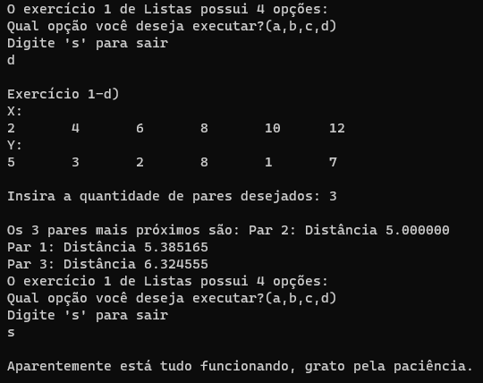

# Treinamento em Listas, Pilhas e Filas Estáticas e Dinâmicas

[](https://devdocs.io/c/)
[](https://code.visualstudio.com/docs/?dv=linux64_deb)


## Conteúdos

<p align="center">
 <a href="#apresentação">Apresentação</a> •
 <a href="#lógica">Lógica</a> • 
 <a href="#compilação-e-execução">Compilação e Execução</a> • 
 <a href="#autores">Autores</a> • 
</p>

---

## Apresentação

Este é um subexercício de uma Lista de Exercícios, quem criou esta lógica, a implementou e como compila-la pode ser visto na [explicação do Exercício geral](/readme.md). Aqui só trataremos do subexercício B. 

O enunciado deste subexercício é o seguinte:

    D) Escreva uma função que receba pares de listas x = [x1, x2, . . . , xn] e y = [y1, y2, . . . , ym] com n,m > 0 e n = m. Calcule a distância euclidiâna entre os múltiplos pares recebidos e encontre os k pares mais próximos.

Com isso, foi trabalhada a lógica abaixo, que provou ter tido êxito apresentando uma solução plausível para este problema!

## Lógica

É uma função bem direta. O professor em questão informou que podemos considerar que os valores das listas x e y já são a subtração que ocorre no cálculo de distância euclidiana. Com isso em mente, não existe muita dificuldade na lógica do algoritmo, só é necessário recolher os valores dos arquivos das listas, utilizando-se disso, foi criado um contador para ir somando a quantidade de valores que teremos nessa lista. Após as listas criadas, foi perguntado a quantidade de pares mais próximos que desejam ser encontrados, esse valor precisa necessariamente ser menor ou igual que o valor do tamanho da Lista, pois não é possível encontrar os 5 pares mais próximos em uma lista de 4 pares.

Com o tamanho da Lista sendo um dado conhecido, é criada uma matriz de Float de tamanho 2xTamanho da Lista, onde a primeira linha será meramente o índice inicial do par na Listas criadas, e a segunda linha será a distância euclidiana de cada par. De posse dessa matriz, é meramente realizado o bubble sort utilizando-se a linha da distância da matriz como o "vetor" a ser ordenado, porém ordenando ambas as linhas, para assim sabermos qual o índice do par mais próximo.

---

## Exemplo

### Entrada 1

```
2
4
6
8
10
12
```

### Entrada 2 

```
5
3
2
8
1
7
```

### Saída



---

## Compilação e Execução

O programa feito de acordo com a proposta possui um arquivo Makefile que realiza todo o procedimento de compilação e execução. Para tanto, temos as seguintes diretrizes de execução:


| Comando                |  Função                                                                                           |                     
| -----------------------| ------------------------------------------------------------------------------------------------- |
|  `make clean`          | Apaga a última compilação realizada contida na pasta build                                        |
|  `make`                | Executa a compilação do programa utilizando o gcc, e o resultado vai para a pasta build           |
|  `make run`            | Executa o programa da pasta build após a realização da compilação             


---

## Autores

Elaborado por [Henrique Souza Fagundes](https://github.com/ohenriquesouza), [Joao Pedro Martin Espíndola](https://github.com/JoaoMEspindola?tab=repositories), [Pedro Henrique Louback Campos](https://github.com/PedroLouback) e [Pedro Pinheiro](https://github.com/ppinheirosiqueira) 

Alunos do 3° periodo do curso de `Engenharia da Computação` no [CEFET-MG](https://www.cefetmg.br)