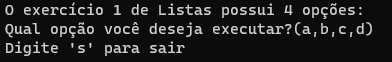

# Treinamento em Listas, Pilhas e Filas Estáticas e Dinâmicas

## Conteúdos

 <a href="#apresentação">Apresentação</a> •
 <a href="#bibliotecas">Bibliotecas</a> •
 <a href="#subexercicios">Subexercícios</a> •
 <a href="#compilação-e-execução">Compilação e Execução</a> • 
 <a href="#autores">Autores</a>

---

## Apresentação

Foi proposto pelo professor [Michel Pires da Silva](http://lattes.cnpq.br/1449902596670082) da matéria de `Arquitetura e Estruturas de Dados 1 do 3º Período do curso de Engenharia da Computação` uma lista de exercícios para treinamento de 3 tipos diferentes de `Estruturas de Dados` com o objetivo de praticar e adquirir experiência com esses diferentes tipos. O exercício de nº 1, contém práticas do Tipo Abstrato de Dados Lista obtendo subexercícios de **A** até **D** que devem ser resolvidos conforme as regras de manipulação. Como a documentação de todos esses subexercícios é extensa demais, nessa documentação, são meramente citados o tipo de dado utilizado, além de quais bibliotecas serão utilizadas em todos e sua compilação, que ocorre para todas os subexercícios ao mesmo tempo, pois foi requerido que fizessemos um menu onde se escolhesse qual subexercício seria executado.

A Lista Dinâmica utilizada é a mesma da básica existente na [biblioteca do professor da matéria](https://github.com/mpiress/dynamic_list).

O menu implementado foi simples, utilizando de um switch case, onde a pessoa pode escolher entre ir para algum subexercício (A, B, C e D), ou sair (S).

## Bibliotecas

Para o funcionamento do programa, é necessário incluir as seguintes bibliotecas: 
<ul>
    <li><code>#include 'stdio.h'</code></li>
    <li><code>#include 'stdlib.h'</code></li>
    <li><code>#include 'stdbool.h'</code></li>
    <li><code>#include 'time.h'</code></li>
    <li><code>#include 'math.h'</code></li>
    <li><code>#include 'ctype.h'</code></li>
</ul>

## Subexercícios

Segue abaixo a explicação de cada subexercício separadamente:
<ul>
    <li><a href="https://github.com/ppinheirosiqueira/Treinamento-em-Listas-Pilhas-e-Filas-Estaticas-e-Dinamicas/blob/main/Exercicio%201/LetraA.md">Letra A</a></li>
    <li><a href="https://github.com/ppinheirosiqueira/Treinamento-em-Listas-Pilhas-e-Filas-Estaticas-e-Dinamicas/blob/main/Exercicio%201/LetraB.md">Letra B</a></li>
    <li><a href="https://github.com/ppinheirosiqueira/Treinamento-em-Listas-Pilhas-e-Filas-Estaticas-e-Dinamicas/blob/main/Exercicio%201/LetraC.md">Letra C</a></li>
    <li><a href="https://github.com/ppinheirosiqueira/Treinamento-em-Listas-Pilhas-e-Filas-Estaticas-e-Dinamicas/blob/main/Exercicio%201/LetraD.md">Letra D</a></li>
</ul>

---

## Exemplo

### Menu

---

## Compilação e Execução

O programa feito de acordo com a proposta possui um arquivo Makefile que realiza todo o procedimento de compilação e execução. Para tanto, temos as seguintes diretrizes de execução:

| Comando                |  Função                                                                                           |                     
| -----------------------| ------------------------------------------------------------------------------------------------- |
|  `make clean`          | Apaga a última compilação realizada contida na pasta build                                        |
|  `make`                | Executa a compilação do programa utilizando o gcc, e o resultado vai para a pasta build           |
|  `make run`            | Executa o programa da pasta build após a realização da compilação             

---

## Autores

Elaborado por [Henrique Souza Fagundes](https://github.com/ohenriquesouza), [Joao Pedro Martin Espíndola](https://github.com/JoaoMEspindola?tab=repositories), [Pedro Henrique Louback Campos](https://github.com/PedroLouback) e [Pedro Pinheiro](https://github.com/ppinheirosiqueira) 

Alunos do 3° periodo do curso de `Engenharia da Computação` no [CEFET-MG](https://www.cefetmg.br)
