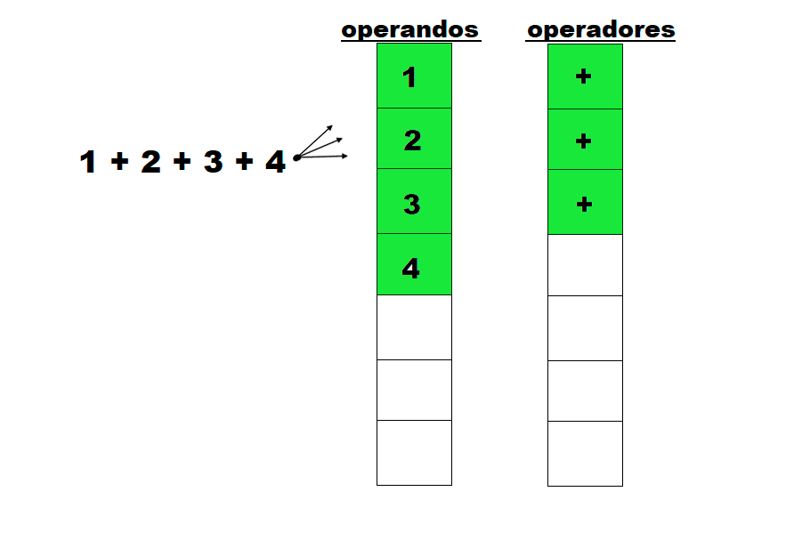
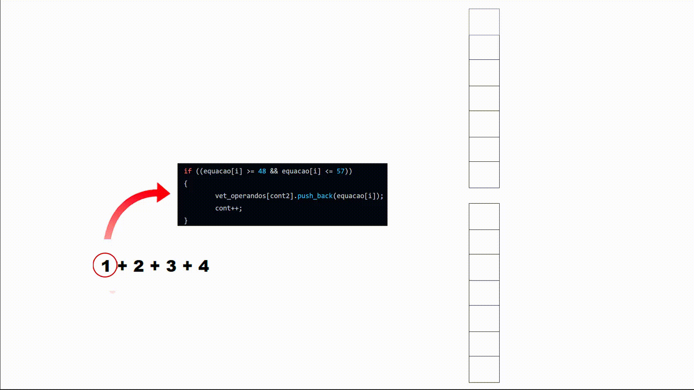
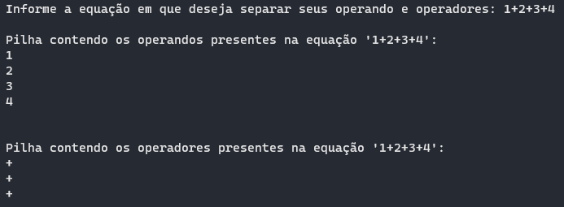

# Treinamento em Listas, Pilhas e Filas Estáticas e Dinâmicas

## Conteúdos

 <a href="#apresentação">Apresentação</a> •
 <a href="#lógica">Lógica</a> • 
 <a href="#representação-gráfica">Representação gráfica</a> • 
 <a href="#bibliotecas">Bibliotecas</a> •
 <a href="#compilação-e-execução">Compilação e Execução</a> • 
 <a href="#autores">Autores</a>

---

## Apresentação

Foi proposto pelo professor [Michel Pires da Silva](http://lattes.cnpq.br/1449902596670082) da matéria de `Arquitetura e Estruturas de Dados 1 do 3º Período do curso de Engenharia da Computação` uma lista de exercícios para treinamento de 3 tipos diferentes de `Estruturas de Dados` com o objetivo de praticar e adquirir experiência com esses diferentes tipos. O exercício de nº 2, contém práticas do Tipo Abstrato de Dados Pilha obtendo subexercícios de **A** até **D** que devem ser resolvidos conforme as regras de manipulação, onde nessa documentação, foi descrita a solução do problema **A**, onde foi proposto o seguinte enunciado:

    A) Escreva uma função que receba uma equação matemática qualquer e retorne duas pilhas. Uma contendo os operandos empilhados da esquerda para a direita e outra contendo os operadores seguindo mesma linha de leitura

Com isso, foi trabalhada a lógica abaixo, que provou ter tido êxito apresentando uma solução plausível para este problema!

---

## Lógica

Para a solução desse problema proposto, utilizamos o `Tipo Abstrato de Dados Pilha Dinâmica` por permitir, de maneira mais simples, a manipulação de seus elementos e a fácil alocação de memória, uma vez que o usuário precisará inserir uma equação onde não é possível determinar o tamanho previamente, e essa pilha permitirá armazenar todos os elementos corretamente.
O programa começa solicitando o usuário uma equação em que deseja separar os operandos dos operadores em diferentes pilhas. Com essa informação obtida, é feita a criação de ambas as Pilhas: _operandos_ e _operadores_ deixando-as vazias antes de alguma inserção. Com as duas pilhas devidamente criadas e vazias, é feita a chamada da Função __RecebeEquacao__, em que recebe como parâmetros a equação e as Pilhas. A Função __RecebeEquacao__ funciona da seguinte maneira:
 
### Como funciona a função RecebeEquacao:

A função é iniciada com a declaração de dois vectors: __vet_operandos__ e __vet_operadores__ _(semelhantes a vetores, mas seu tamanho pode mudar dinamicamente)_, que serão usados para manipular e inserir operadores e operandos dentro das Pilhas. Com isso, inicia-se uma estrutura de repetição `FOR`, na qual irá repetir até que todos os caracteres lidos estejam dispersos, cada um em sua devida Pilha. A primeira estrutura de condição desse `FOR` consiste em verificar se a posição atual da equação é um número de _'0'_ a _'9'_, tal verificação é feita utilizando a conversão de inteiros da tabela `ASCII` sendo '0' igual 48 e '9' igual a 57. Caso seja feita a validação, o número verificado irá ser inserido dentro do vector de __vet_operandos__, feito uma contagem a cada inserção, retornando aquela condição e, com isso, permitindo a inserção de números que possuam mais de um algarismo, armazenando-os em uma única posição do vector. Quando for encontrado um operador, o vector de operandos será deixado de lado, e o operador encontrado será adicionado no vector de __vet_operadores__. Processo esse que ser repetirá até que chegue no último caractere da equação.
Diante disso, o conteúdo dos vectors foram transferidos para suas respectivas Pilhas, utilizando o seguinte método: Foi imposto um `FOR` de *i* em que se iniciava com o valor da contagem de inserções e vá retrocedendo até o final para ser feita a inserção corretamente das primeiras posições da equação nas primeiras posições da fila e de um outro `FOR` de *j* onde "i" é usado para percorrer o vector __vet_operandos__ de trás para frente e o j roda as números que estão dentro desse vector (caso haja algum número com mais de um algarismos), a cada posição percorrida do vector __vet_operando__, é feito o empilhamento dessa posição (*i*) na pilha de _operandos_. Para o armazenamento dos operadores na pilha de _operadores_ foi utilizado o mesmo método, mas possuindo apenas um `FOR` que vai empilhar a cada posição percorrida, sempre empilhando na mesma posição de inserção.

---

## Representação gráfica

•*__Representação 1:__* Segue a representação gráfica de um exemplo onde é feita a leitura da equação informado e a inserção dela na pilha de _operandos_ e de _operadores_ :

<i><b>Figura 1: </b>Representação de inserção de operandos e operados em suas respectivas pilhas</i>

•*__Representação 2:__* Segue uma representação em formato de `GIF` em que exemplifica as inserções passando por uma estrutura de condição:

•*__Representação 3:__* Segue uma representação de saída feito pelo programa elaborado utilizando o mesmo exemplos das representações anteriores:

<i><b>Figura 2: </b>Representação da saída apresentada pelo programa</i>

---

## Bibliotecas

Para o funcionamento do programa, é necessário incluir as seguintes bibliotecas: 
<ul>
    <li><code>#include 'stdlib.h'</code></li>
    <li><code>#include 'stdbool.h'</code></li>
    <li><code>#include 'fstream'</code></li>
    <li><code>#include 'iostream'</code></li>
    <li><code>#include 'vector'</code></li>
    <li><code>#include 'string'</code></li>
</ul>

---

## Compilação e Execução

O programa feito de acordo com a proposta possui um arquivo Makefile que realiza todo o procedimento de compilação e execução. Para tanto, temos as seguintes diretrizes de execução:

| Comando                |  Função                                                                                           |                     
| -----------------------| ------------------------------------------------------------------------------------------------- |
|  `make clean`          | Apaga a última compilação realizada contida na pasta build                                        |
|  `make`                | Executa a compilação do programa utilizando o gcc, e o resultado vai para a pasta build           |
|  `make run`            | Executa o programa da pasta build após a realização da compilação             

---

## Autores

Elaborado por [Henrique Souza Fagundes](https://github.com/ohenriquesouza), [Joao Pedro Martin Espíndola](https://github.com/JoaoMEspindola?tab=repositories), [Pedro Henrique Louback Campos](https://github.com/PedroLouback) e [Pedro Pinheiro](https://github.com/ppinheirosiqueira) 

Alunos do 3° periodo do curso de `Engenharia da Computação` no [CEFET-MG](https://www.cefetmg.br)