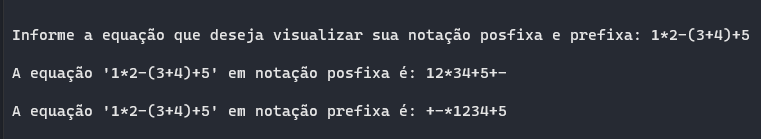

# Treinamento em Listas, Pilhas e Filas Estáticas e Dinâmicas

## Conteúdos

    <a href="#sobre">Sobre</a> •
    <a href="#apresentação">Apresentação</a> •
    <a href="#lógica">Lógica</a> • 
    <a href="#representação-gráfica">Representação gráfica</a> • 
    <a href="#bibliotecas">Bibliotecas</a> •
    <a href="#compilação-e-execução">Compilação e Execução</a> • 
    <a href="#autores">Autores</a>

---

## Sobre

<b>Notação Prefixa</b> 
A Notação Polonesa (Notação de Prefixo), é uma forma de notação para lógica, artitmética e álgebra. É útil principalmente por não precisar de parênteses ou outros tipo de delimitadores para indicar a ordem na qual devem ser realizados os cálculos separadamente. Isso permite uma escrita mais fluída dos elementos da operação. Seu criador foi o matemático polonês <i>Jan Łukasiewicz</i>, com o objetivo de simplificar a lógica nas sentenças matemáticas em 1920. 
<b>Notação Posfixa</b> 
A Notação Polonesa Inversa, conhecida como <b>RPN</b> (<b>R</b>everse <b>P</b>olish <b>N</b>otation) foi criada pelo cientista da computação australiano <i>Charles Hamblin</i> nos anos 50. Tinha como objetivo habilitar armazenamento de memória de endereço zero. A diferença quando comaprada a Notação Polonesa original, a notação posfixa possui algumas vantagens que sua "mãe" não tinha. As vanagens de se utilziar esse tipo de notação computacionalmente são: 
<ul>
    <li> Reduz consideravelmente o número de passos lógicos para se prefazer uma operação binária.</li>
    <li> Trabalha a partir de pares ordenados a <i>priori</i>, somente definindo a lei de composição binária aplicável após a eleição e introdução do desejado par durante o cálculo.</li>
    <li> Busca minimizar os erros de computação.</li>
    <li> Maximiza a velocidade das operações realizadas.</li>
</ul> 
Essa notação ganhou alta notoriedade por ser adotada como método pelas calculadoras da marca HP. 

## Apresentação

Foi proposto pelo professor [Michel Pires da Silva](http://lattes.cnpq.br/1449902596670082) da matéria de `Arquitetura e Estruturas de Dados 1 do 3º Período do curso de Engenharia da Computação` uma lista de exercícios para treinamento de 3 tipos diferentes de `Estruturas de Dados` com o objetivo de praticar e adquirir experiência com esses diferentes tipos. O exercício de nº 2, contém práticas do Tipo Abstrato de Dados Pilha obtendo subexercícios de **A** até **D** que devem ser resolvidos conforme as regras de manipulação, onde nessa documentação, foi descrita a solução do problema **B**, onde foi proposto o seguinte enunciado:

    B) Considerando a função elaborada no item (a), crite uma segunda função que apresente a operação matemática em notação prefixa e posfixa.

Com isso, foi trabalhada a lógica abaixo, que provou ter tido êxito apresentando uma solução plausível para este problema!

---

## Lógica

Para a solução desse problema proposto, utilizamos o `Tipo Abstrato de Dados Pilha Dinâmica` por permitir, de maneira mais simples, a manipulação de seus elementos e a fácil alocação de memória, uma vez que o usuário precisará inserir uma equação onde não é possível determinar o tamanho previamente, e essa pilha permitirá armazenar todos os elementos corretamente.
O programa começa solicitando o usuário uma equação em que deseja visualizar sua forma em notação _prefixa_ e _posfixa_. Com essa informação obtida, é chamada das Funções __EquacaoPosfixa__ e __EquacaoPrefixa__, em que ambas recebem como parâmetro a equação digitada pelo usuário onde é feita o uso de uma pilha em que mudará a ordem dos operadores de infixo para _posfixo_ ou _prefixo_.
Para a construção da notação _prefixa_ foi necessário primeiramente o desenvolvido da função __EquacaoPosfixa__ e o uso de uma função chamada __inverte__ em que consistia na inversão da equação posfixa e uma lógica implementada na função __EquacaoPrefixa__ para que fosse construída perfeitamente, onde será feita uma explicação detalhada mais abaixo.

### Como funciona a função Prioridade:

Foi construído uma função chamada Prioridades onde a mesma recebe como parâmetro o operador da equação e verifica o peso da mesmo onde caso seja _*_ ou */* vai receber o peso 2, fazendo com que a função retorne esse número e se caso for o operador _+_ ou _-_, vai receber peso 1, fazendo a função retornar esse número, fazendo com que haja uma facilidade maior na construção da notação posfixa onde verifica essa prioridade para fazer com que seja empurrada para trás ou não através de estruturas de decisões feitas na função __EquacaoPosfixa__. 
 
### Como funciona a função EquacaoPosfixa:

A função para a construção da equação foi a primeira a ser desenvolvida por ser um tratamento mais fácil, podendo ser usada para a equação prefixa mais a frente fazendo apenas algumas inversões. Ela se inicia fazendo uma varredura, caractere por caractere, da expressão _infixa_ passada como parâmetro da esquerda para a direita através de um `FOR` de *i* que recebe como seu limite o tamanho da equação, verificando através de um estrutura de condição (`IF`) se o caractere percorrido é um operando, caso seja o mesmo é acrescentado na variável *equacao_posfixa*, que será retornada ao final como notação posfixa, caso seja verificado que a pilha não esteja vazia, que o caractere percorrido seja um operador e que possui peso maior, verificado na função __Prioridade__, que  o operador em que está empilhado na pilha ele vai ser empurrado para a trás, caso contrário vai ser desempilhado todos os operadores que estão na pilha que são maiores, em peso, que o operador que está sendo verificado e depois empilha-lo deixando-o no topo da pilha. Caso seja verificado no `IF` que possui um caractere de abertura de parênteses **'('** ele vai ser empurrado para a pilha para no final ser removido pois uma notação posfixa não possui parênteses, e se for verificado o fechamento de um parênteses **')'** a pilha vai ser desempilhada elemento por elemento, armazenando aquele que não é parênteses na *equacao_posfixa*,  até que encontre uma abertura de parênteses coincidindo com o fechamento, com isso, ambos parênteses vão ser descartados da pilha. Após percorrer toda a equação vai ser feita uma limpeza na fila através de uma estrutura de repetição `WHILE` que vai rodar enquanto a lista não estiver vazia desempilhando os operadores que ficaram na lista, adicionando-os no final da *equacao_posfixa* e ao terminar isso a função irá retornar a *equacao_posfixa* para que possa ser imprimida na **main** e utilizada para a construção da *equacao_prefixa*.

### Como funciona a função inverte:

A construção da função foi pensando para o desenvolvimento da notação _prefixa_ onde foi preciso inverter as equações para que fosse possível chegar na notação _prefixa_, com isso essa função recebe como parâmetro uma equação e inverte a mesma inserindo em uma string chamada *equação_reversa* através de um `WHILE` que percorre a equação até o final começando com o i na última posição da equação passada como parâmetro e vai inserindo a cada vez que anda para o início na *equação_reversa*, retornando essa equação no final resultando na reversa da equação passada, sendo primordial para a construção da notação _prefixa_.

### Como funciona a função EquacaoPrefixa:

A função foi construída ao perceber que se fosse invertido a equação _infixa_ e utilizar o método da construção da equação _posfixa_ e invertesse a equação _posfixa_ dessa inversão resultaria em uma equação _prefixa_, foi implementada a função __inverte__ na equação infixa passada como parâmetro na função __EquacaoPrefixa__, tratando até de parênteses trocando suas aberturas por fechamentos e vice-versa e após isso foi chamado o método em que constroi uma equação _posfixa_ a função __EquacaoPosfixa__, onde retorna uma equação _posfixa_ da equação invertida, logo então essa equação é invertida novamente tornando agora uma equação _posfixa_ fazendo com que a função retorne-a para a impressão na **main**.

---

## Exemplo de execução

•*__Exemplo 1:__* Equação digitada pelo usuário e transformada em uma notação _posfixa_: **1 * 2 - (3 + 4) + 5**

| Caractere lido   |  Operação na pilha   |  Pilha   |   Expressão Posfixa  |                                             
|------------------|----------------------|--------- |----------------------|
|  `1`             |                      |   Vazia  |         1            |                                  
|  `*`             |      EMPILHA         |     *    |         1            |                                     
|  `2`             |                      |     *    |         1 2          |
|  `-`             |  VERIFICA & EMPILHA  |     -    |         1 2*         |
|  `(`             |      EMPILHA         |    -(    |         1 2*         |
|  `3`             |                      |    -(    |         1 2*3        |
|  `+`             |  VERIFICA & EMPILHA  |    -(+   |         1 2*3        |
|  `4`             |                      |          |         1 2*3 4      |
|  `)`             | DESEMPILHA &  ANEXA  |     -    |         1 2*3 4+     |
|  `+`             |  VERIFICA & EMPILHA  |     +    |         1 2*3 4+-    |
|  `5`             |                      |     +    |         1 2*3 4+5-   |
|                  |                      |          |                      |
|  <b>FINAL</B>    |    DESEMPILHA ATÉ  FICAR VAZIA    |   +       |        <b>1 2*3 4+5+-</b>               |

•*__Exemplo 2:__* Equação digitada pelo usuário e transformada em uma notação _prefixa_: **1 * 2 - (3 + 4) + 5**

|   Equacao lida   |       Operação       |  Expressão após operação  |                                             
|------------------|----------------------|---------------------------|
|  `1*2-(3+4)+5`   |       INVERSÃO       |         5+(4+3)-2*1       |                                  
|  `5+(4+3)-2*1`   |REMOÇÃO DE PARENTESES |         5+4+3-2*1         |                                     
|  `5+4+3-2*1`     | POSFIXA DA INVERTIDA |         5+4321*-+         |
|  `5+4321*-+`     |  INVERSÃO DA POSFIXA |         +-*1234+5         |
|  <b>FINAL</B>    |    EQUAÇÃO PREFIXA   |     <b>+-*1234+5**</b>       |

•*__Exemplo 3:__* Segue uma representação de saída feito pelo programa elaborado utilizando a mesma equação utilizada nos exemplos anteriores:

<i><b>Figura 1: </b>Representação da saída apresentada pelo programa</i>

---

## Bibliotecas

Para o funcionamento do programa, é necessário incluir as seguintes bibliotecas: 
<ul>
    <li><code>#include 'stdlib.h'</code></li>
    <li><code>#include 'stdbool.h'</code></li>
    <li><code>#include 'fstream'</code></li>
    <li><code>#include 'iostream'</code></li>
    <li><code>#include 'vector'</code></li>
    <li><code>#include 'string'</code></li>
</ul>

---

## Compilação e Execução

O programa feito de acordo com a proposta possui um arquivo Makefile que realiza todo o procedimento de compilação e execução. Para tanto, temos as seguintes diretrizes de execução:

| Comando                |  Função                                                                                           |                     
| -----------------------| ------------------------------------------------------------------------------------------------- |
|  `make clean`          | Apaga a última compilação realizada contida na pasta build                                        |
|  `make`                | Executa a compilação do programa utilizando o gcc, e o resultado vai para a pasta build           |
|  `make run`            | Executa o programa da pasta build após a realização da compilação             

---

## Autores

Elaborado por [Henrique Souza Fagundes](https://github.com/ohenriquesouza), [Joao Pedro Martin Espíndola](https://github.com/JoaoMEspindola?tab=repositories), [Pedro Henrique Louback Campos](https://github.com/PedroLouback) e [Pedro Pinheiro](https://github.com/ppinheirosiqueira) 

Alunos do 3° periodo do curso de `Engenharia da Computação` no [CEFET-MG](https://www.cefetmg.br)