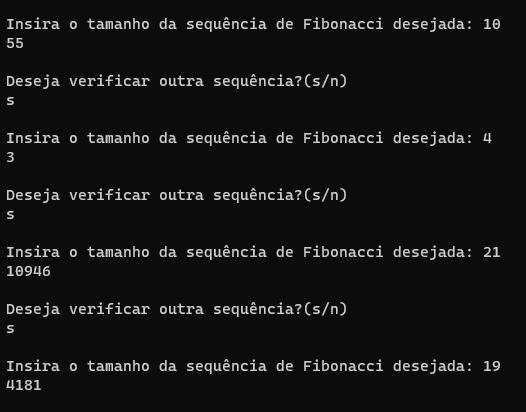

# Treinamento em Listas, Pilhas e Filas Estáticas e Dinâmicas

## Conteúdos

 <a href="#apresentação">Apresentação</a> •
 <a href="#lógica">Lógica</a> • 
 <a href="#exemplo">Exemplo</a> • 
 <a href="#discussão">Discussão</a> • 
 <a href="#compilação-e-execução">Compilação e Execução</a> • 
 <a href="#autores">Autores</a> • 

---

## Apresentação

Este é um subexercício de uma Lista de Exercícios, quem criou esta lógica, a implementou e como compila-la pode ser visto na [explicação do Exercício geral](/readme.md). Aqui só trataremos do subexercício A. 

O enunciado deste subexercício é o seguinte:

    D) Crie uma função para realizar o calculo de fibonacci para um valor de N. Contudo, utilize uma pilha para armazenar os pré resultados, utilizando-os para outros calculos sempre que possível. Para tanto, considere manter no topo da pilha o cálculo para o valor de (n-1). Crie uma forma de identificar para qual n-1 o valor foi cálculado para não utilizar valores incorretos para calculos longos. Feito isso responda: Manter os cálculos em pilha pode ajudar a economizar computações? Quando seria melhor empregado?

Com isso, foi trabalhada a lógica abaixo, que provou ter tido êxito apresentando uma solução plausível para este problema!

## Lógica

Fibonacci é uma sequência que começa no N=3, e nela, seu resultado é sempre igual a soma dos dois últimos valores, o valor para N=1 e N=2 foram determinados como 1. Assim, o valor de N=3 é 2, de N=4 é 3, e assim seguindo.

Com isso em mente, foi criado um algoritmo recursivo que calcula esse Fibonacci e na primeira execução do programa cada resultado do Fibonacci calculado é adicionado numa Pilha que possui dois valores, o do N e o do resultado do Fibonacci.

Após a primeira execução, qualquer novo pedido de N será verificado se esse N é igual ou menor que o valor do topo da Pilha, se for, é só necessário desempilhar até chegar neste N e devolver o valor que foi encontrado, sem ter que recalcular. Caso não seja, é necessário calcular até chegar neste novo valor e ir adicionando esses valores no topo da Pilha.

---

## Exemplo

### Saída

---

## Discussão

Manter os cálculos em pilha pode ajudar a economizar computações? Depende.

Quando seria melhor empregado? Quando o Fibonacci for utilizado diversas vezes. 

A função de Fibonacci é uma função recursiva que gasta muito recurso do computador. Quando souber que utilizará várias vezes esta função, é uma ótima manter esses valores guardados para que não sejam recalculados e não desperdicem tempo.

---

## Compilação e Execução

O programa feito de acordo com a proposta possui um arquivo Makefile que realiza todo o procedimento de compilação e execução. Para tanto, temos as seguintes diretrizes de execução:

| Comando                |  Função                                                                                           |                     
| -----------------------| ------------------------------------------------------------------------------------------------- |
|  `make clean`          | Apaga a última compilação realizada contida na pasta build                                        |
|  `make`                | Executa a compilação do programa utilizando o gcc, e o resultado vai para a pasta build           |
|  `make run`            | Executa o programa da pasta build após a realização da compilação             

---

## Autores

Elaborado por [Henrique Souza Fagundes](https://github.com/ohenriquesouza), [Joao Pedro Martin Espíndola](https://github.com/JoaoMEspindola?tab=repositories), [Pedro Henrique Louback Campos](https://github.com/PedroLouback) e [Pedro Pinheiro](https://github.com/ppinheirosiqueira) 

Alunos do 3° periodo do curso de `Engenharia da Computação` no [CEFET-MG](https://www.cefetmg.br)