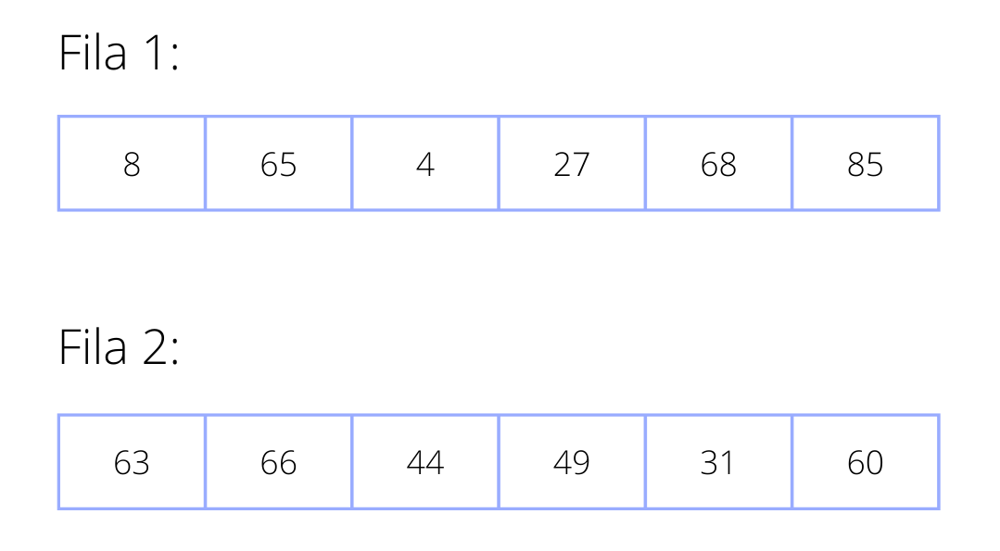
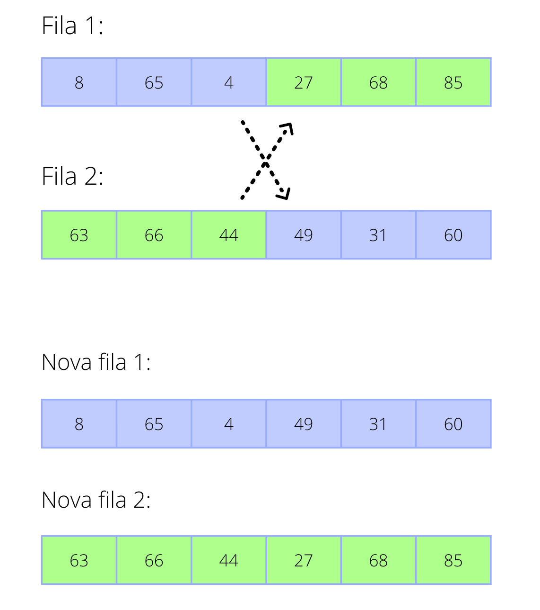
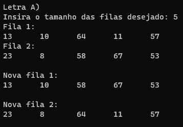

# Treinamento em Listas, Pilhas e Filas Estáticas e Dinâmicas

## Conteúdos

    <a href="#apresentação">Apresentação</a> •
    <a href="#lógica">Lógica</a> • 
    <a href="#exemplo">Exemplo de execução</a> •
    <a href="#compilação-e-execução">Compilação e Execução</a> • 
    <a href="#autores">Autores</a>

---

## Apresentação

Foi proposto pelo professor [Michel Pires da Silva](http://lattes.cnpq.br/1449902596670082) da matéria de `Arquitetura e Estruturas de Dados 1 do 3º Período do curso de Engenharia da Computação` uma lista de exercícios para treinamento de 3 tipos diferentes de `Estruturas de Dados` com o objetivo de praticar e adquirir experiência com esses diferentes tipos. O exercício de nº 3, contém práticas do Tipo Abstrato de Dados Fila obtendo subexercícios de **A** até **C** que devem ser resolvidos conforme as regras de manipulação, onde nessa documentação, foi descrita a solução do problema **A**, onde foi proposto o seguinte enunciado:

    A)  Escreva uma função que receba pares de filas, ambas de tanho n, divida ambas ao meio e ligue as metadas para compor duas novas filas, as quais devem ser retornadas para o usuário. Tais filas devem ser definidas como dinâmicas.

Com isso, foi trabalhada a lógica abaixo, que provou ter tido êxito apresentando uma solução plausível para este problema!

---

## Lógica

Para a solução desse problema proposto, utilizamos o `Tipo Abstrato de Dados Fila Dinâmica`  como pede o exercício.
O programa começa solicitando o usuário o tamanho das filas f e f2. Com essa informação obtida, é inserido, separadamente, nas filas números aleatórios positivos utilizando a função <code>rand()</code> criando assim duas filas distintas.
No enunciado pede-se que, as duas filas sejam divididas ao meio e suas metades sejam ligadas, a interpretação do grupo foi de que, a primeira metade da primeira fila seria ligada à segunda metade da segunda fila e a primeira metade da segunda à segunda da primeira. Para partir essas filas e realizar as ligações usou-se a função <code>separaFila</code>.

### Como funciona a função separaFila:

A função recebe como parâmetros as duas filas a serem divididas e o tamanho das mesmas. Para dividir as filas utilizou-se dois <em>Blocos</em> auxiliares, um para cada fila, `blockAux` e `blockAux2`.
Em primeiro momento, esses dois blocos percorrerão a primeira metade das duas filas enfileirando os elementos em <em>Filas</em> auxiliares`filaAux` e `filaAux2`, respectivamente.
Após esse enfileiramento, terá assim, duas novas filas com metade dos elementos e os respectivos blocos apontando para o primeiro elemento da segunda metade das Filas recebidas.
Por fim, para enfileirar os últimos elementos, inverte-se os blocos, a `filaAux` receberá os próximos elementos do `blockAux2` e a `filaAux2` receberá os próximos elementos do `blockAux`.
 
---

## Exemplo

### Entrada

### Saída

### Exemplo Saída Prático

## Compilação e Execução

O programa feito de acordo com a proposta possui um arquivo Makefile que realiza todo o procedimento de compilação e execução. Para tanto, temos as seguintes diretrizes de execução:

| Comando                |  Função                                                                                           |                     
| -----------------------| ------------------------------------------------------------------------------------------------- |
|  `make clean`          | Apaga a última compilação realizada contida na pasta build                                        |
|  `make`                | Executa a compilação do programa utilizando o gcc, e o resultado vai para a pasta build           |
|  `make run`            | Executa o programa da pasta build após a realização da compilação             

---

## Autores

Elaborado por [Henrique Souza Fagundes](https://github.com/ohenriquesouza), [Joao Pedro Martins Espíndola](https://github.com/JoaoMEspindola?tab=repositories), [Pedro Henrique Louback Campos](https://github.com/PedroLouback) e [Pedro Pinheiro](https://github.com/ppinheirosiqueira) 

Alunos do 3° periodo do curso de `Engenharia da Computação` no [CEFET-MG](https://www.cefetmg.br)