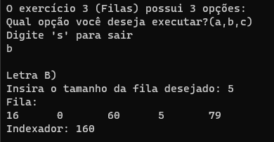

# Treinamento em Listas, Pilhas e Filas Estáticas e Dinâmicas

## Conteúdos

 <a href="#apresentação">Apresentação</a> •
 <a href="#lógica">Lógica</a> • 
 <a href="#exemplo">Exemplo</a> • 
 <a href="#compilação-e-execução">Compilação e Execução</a> • 
 <a href="#autores">Autores</a> • 

---

## Apresentação

Este é um subexercício de uma Lista de Exercícios, quem criou esta lógica, a implementou e como compila-la pode ser visto na [explicação do Exercício geral](/readme.md). Aqui só trataremos do subexercício B. 

O enunciado deste subexercício é o seguinte:

    B) Escreva uma função que aplica uma equação matemática qualquer aos números de uma fila. Essa equação tem por objetivo produzir um indexador para a fila dada como entrada, logo, precisa ser retornado junto com a fila para o usuário.

Com isso, foi trabalhada a lógica abaixo, que provou ter tido êxito apresentando uma solução plausível para este problema!

## Lógica

A função escolhida foi a mais simples de se comprovar, a soma. Por isso, ao receber uma fila qualquer, seus valores são somados, podendo acarretar em alguns casos duas filas possuírem o mesmo indexador, porém sendo mais seguro que multiplicação ou divisão, onde qualquer valor igual a 0 poderia acabar com o Indexador por completo. Existem vários Indexadores que poderiam ser feitos, porém para a lógica em si isso não importa, por isso, foram meramente somados.

Para se somar todos os valores de uma Fila é simples, começando do primeiro bloco, é só ir somando o valor deste bloco e passar para o próximo, até que chegue no fim da fila.

---

## Exemplo

### Saída

---

## Compilação e Execução

O programa feito de acordo com a proposta possui um arquivo Makefile que realiza todo o procedimento de compilação e execução. Para tanto, temos as seguintes diretrizes de execução:

| Comando                |  Função                                                                                           |                     
| -----------------------| ------------------------------------------------------------------------------------------------- |
|  `make clean`          | Apaga a última compilação realizada contida na pasta build                                        |
|  `make`                | Executa a compilação do programa utilizando o gcc, e o resultado vai para a pasta build           |
|  `make run`            | Executa o programa da pasta build após a realização da compilação             

---

## Autores

Elaborado por [Henrique Souza Fagundes](https://github.com/ohenriquesouza), [Joao Pedro Martin Espíndola](https://github.com/JoaoMEspindola?tab=repositories), [Pedro Henrique Louback Campos](https://github.com/PedroLouback) e [Pedro Pinheiro](https://github.com/ppinheirosiqueira) 

Alunos do 3° periodo do curso de `Engenharia da Computação` no [CEFET-MG](https://www.cefetmg.br)
