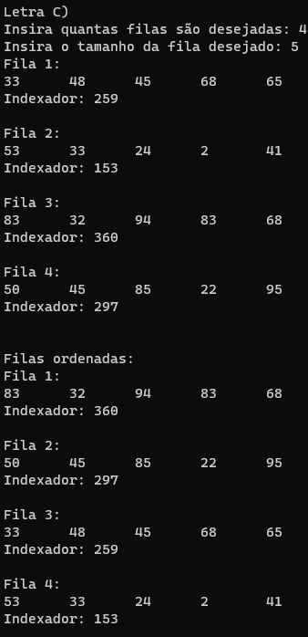

# Treinamento em Listas, Pilhas e Filas Estáticas e Dinâmicas

## Conteúdos

 <a href="#apresentação">Apresentação</a> •
 <a href="#lógica">Lógica</a> • 
 <a href="#exemplo">Exemplo</a> • 
 <a href="#compilação-e-execução">Compilação e Execução</a> • 
 <a href="#autores">Autores</a> • 

---

## Apresentação

Este é um subexercício de uma Lista de Exercícios, quem criou esta lógica, a implementou e como compila-la pode ser visto na [explicação do Exercício geral](/readme.md). Aqui só trataremos do subexercício C. 

O enunciado deste subexercício é o seguinte:

    C) Elabore uma função que receba um conjunto de filas, todas com valores de indexação conforme [item (b)](/LetraB.md). Ordene esse grupo de filas pelo método da bolha e as retorne ao usuário considerando o maior valor de indexação como cabeça dessa ordem.

Com isso, foi trabalhada a lógica abaixo, que provou ter tido êxito apresentando uma solução plausível para este problema!

## Lógica

A lógica aqui continua bem simples. Foi criada uma nova Estrutura, chamada de Fila Indexada. Essa estrutura recebe dois valores, um é uma Fila, o outro é um valor inteiro, o Indexador. 

No começo do programa são perguntadas quantas Listas desejam-se testar e o tamanho delas. Com isso em mente, é criado um Vetor de FilaIndexada, onde cada fila irá para uma posição deste vetor, junto do seu Indexador já calculado. Com isso feito, é meramente uma questão de ordenar com o método da Bolha como requerido pelo professor, com o único detalhe de alternar a forma como geralmente é ordenado, dado que ele deseja o maior na cabeça, e não no final.

---

## Exemplo

### Saída

---

## Compilação e Execução

O programa feito de acordo com a proposta possui um arquivo Makefile que realiza todo o procedimento de compilação e execução. Para tanto, temos as seguintes diretrizes de execução:

| Comando                |  Função                                                                                           |                     
| -----------------------| ------------------------------------------------------------------------------------------------- |
|  `make clean`          | Apaga a última compilação realizada contida na pasta build                                        |
|  `make`                | Executa a compilação do programa utilizando o gcc, e o resultado vai para a pasta build           |
|  `make run`            | Executa o programa da pasta build após a realização da compilação             

---

## Autores

Elaborado por [Henrique Souza Fagundes](https://github.com/ohenriquesouza), [Joao Pedro Martin Espíndola](https://github.com/JoaoMEspindola?tab=repositories), [Pedro Henrique Louback Campos](https://github.com/PedroLouback) e [Pedro Pinheiro](https://github.com/ppinheirosiqueira) 

Alunos do 3° periodo do curso de `Engenharia da Computação` no [CEFET-MG](https://www.cefetmg.br)
